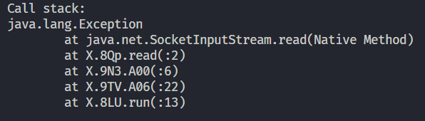
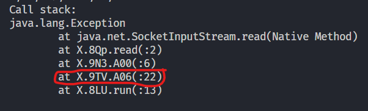

# WA Mobile Logging Scripts

> [!IMPORTANT]
> You will need to use an Emulator or a Rooted Device, and we'll use Frida for logging.  
> **Note:** I will not cover how to set up Frida. I recommend watching this [video](https://www.youtube.com/watch?v=RXw-4TymR5s) for guidance.

## Tools Needed

- [Frida](https://github.com/frida/frida) to log WhatsApp.
- Emulator or Rooted Device (this tutorial will use an Emulator).

## How to Log RECV Nodes

1. **Run socket.js script**  

   ```bash
   frida -U -f com.whatsapp -l path/to/socket.js
   ```

   Wait for SocketInputStream log.



3. **Find correct class in Log**  
   Will always be after `.run()`



4. **Replace the Class**  
   Replace `9TV` and `A06` in script.

6. **Run the Script with Frida**  
   Execute the following command to run Frida and start logging:

   ```bash
   frida -U -f com.whatsapp -l path/to/script
   ```
## How to Log SENT Nodes

1. **Run socket.js script**  

   ```bash
   frida -U -f com.whatsapp -l path/to/socket.js
   ```

   Wait for SocketOutputStream log.


3. **Find correct class in Log**  


4. **Replace the Class**  
   Replace `7OT` in script.

6. **Run the Script with Frida**  
   Execute the following command to run Frida and start logging:

   ```bash
   frida -U -f com.whatsapp -l path/to/script
   ```
