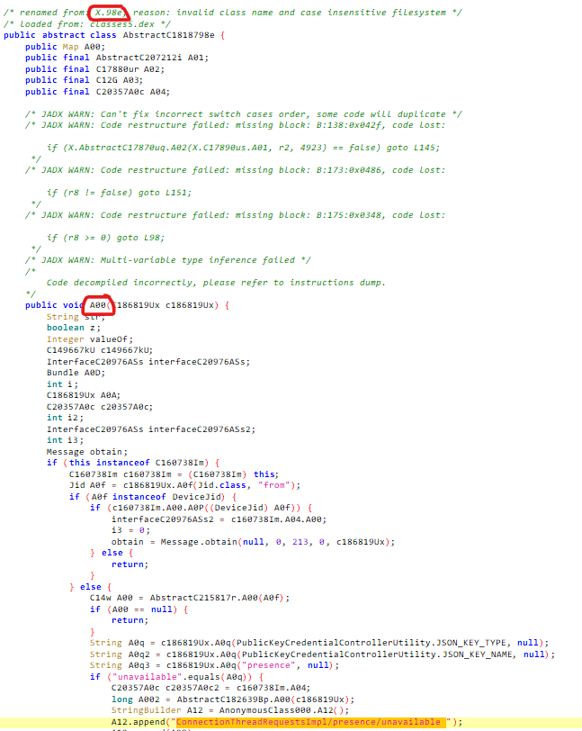
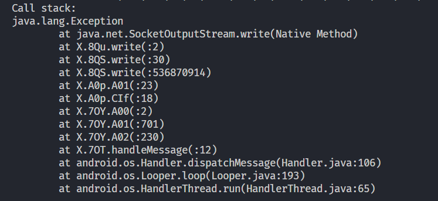
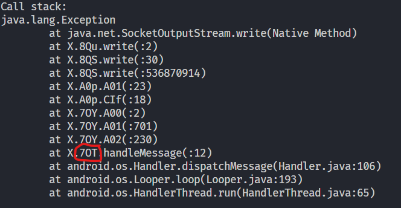

# WA Mobile Logging Scripts

> [!IMPORTANT]
> You will need to use an Emulator or a Rooted Device, and we'll use Frida for logging.  
> **Note:** I will not cover how to set up Frida. I recommend watching this [video](https://www.youtube.com/watch?v=RXw-4TymR5s) for guidance.

## Tools Needed

- [JADX](https://github.com/skylot/jadx) to decompile the APK.
- [Frida](https://github.com/frida/frida) to log WhatsApp.
- Emulator or Rooted Device (this tutorial will use an Emulator).
- Whatsapp APK > Ensure the APK version matches the one installed on your Emulator (VERY IMPORTANT)

## How to Log RECV Nodes

1. **Open APK in JADX**  
   Open the downloaded APK in JADX to begin decompiling.

2. **Search for the Correct Class**  
   In JADX, search for `ConnectionThreadRequestsImpl/presence/unavailable`.


3. **Open the Class**  
   When you find the search result, open the corresponding class.

4. **Find correct Names**  
   The first you will replace in `Java.use()`, the last you will replace `A06`.



5. **Run the Script with Frida**  
   Execute the following command to run Frida and start logging:

   ```bash
   frida -U -f com.whatsapp -l path/to/script
   ```

## How to Log SENT Nodes

1. **Run socket.js script**  
   Wait for SocketOutputStream log.



3. **Find correct class in Log**  



4. **Replace the Class**  
   Replace `7OT` in script.

6. **Run the Script with Frida**  
   Execute the following command to run Frida and start logging:

   ```bash
   frida -U -f com.whatsapp -l path/to/script
   ```
