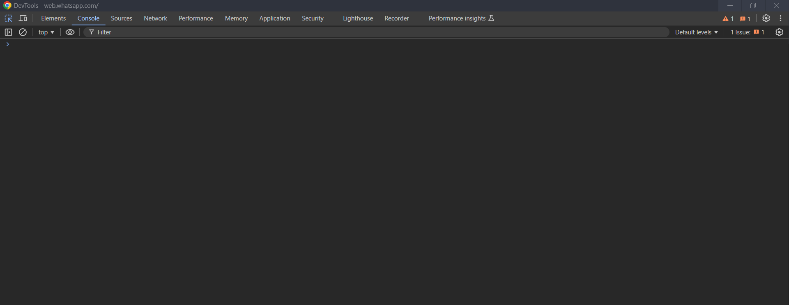

# WA Web Logging Scripts

Follow the steps below to run the scripts on WhatsApp Web:

1. **Go to WhatsApp Web**.
2. **Open the Inspector**: press `Ctrl + Shift + C` (Windows) in Chrome.
3. Navigate to the **Console** tab.

4. Paste the script code in the console and press **Enter**.

All information will be logged in the Console tab. If you reload the page, you will need to re-inject the script.

> recv/sent scripts was provided by @PurpShell in this [Gist](https://gist.github.com/PurpShell/13f198b996b46e3e783bee1ef06d1a35)